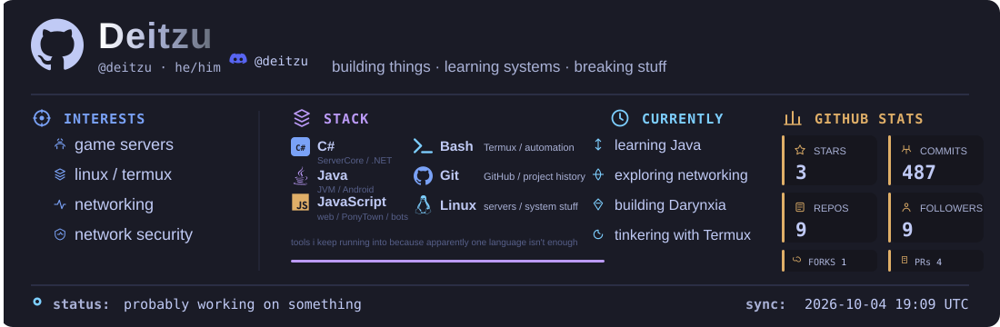
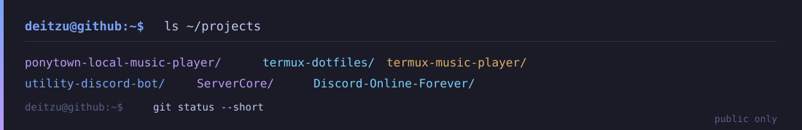
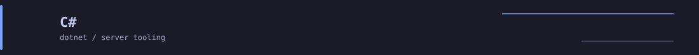
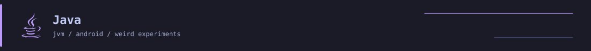
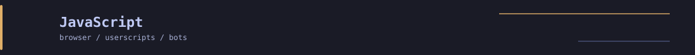
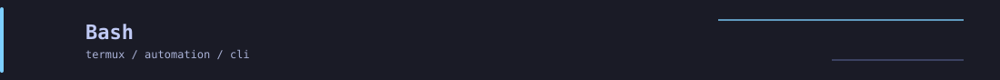
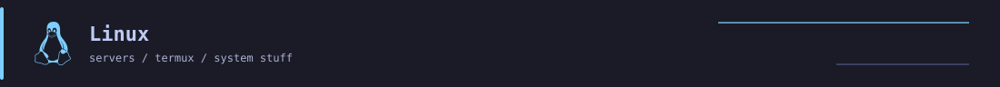
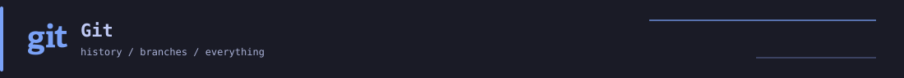

### Hello There 👋
> a random network student learning how to code

More about me

### Detail Stack

> things i'm learning because i keep running into them. some are actually useful, some just kinda happened.

**why:** mostly because TShock and ServerCore dragged me into .NET. now i'm learning the ecosystem while actually building server stuff.  
**where:** Terraria server tooling, plugins, and whatever .NET thing i end up touching next.

**why:** a lot of the weird stuff i want to mess with runs on the JVM. i'm learning it by poking at Java apps, Android stuff, and the occasional `.jar` that refuses to cooperate.  
**where:** JVM experiments, Android, game/app compatibility stuff.

**why:** mostly browser stuff. userscripts, PonyTown tools, Discord bots, and random web experiments whenever the browser gets in my way.  
**where:** browser scripting, little tools, bots, and web experiments.

**why:** mostly Termux and automation. if i have to type the same command more than a few times, it probably deserves a script.  
**where:** setup scripts, CLI tools, aliases, and random shell experiments.

**why:** most of my system-level tinkering ends up here anyway. servers, Termux, development, random fixes, random new problems.  
**where:** basically the environment behind most of the other stuff here.

**why:** useful for keeping projects from turning into a pile of random versions and forgotten changes. basically the undo button for experiments.  
**where:** pretty much everything i actually keep around.

<!-- Brand icons in the SVGs use Font Awesome Free 6.7.2, licensed under CC BY 4.0. -->

&nbsp;
&nbsp;

